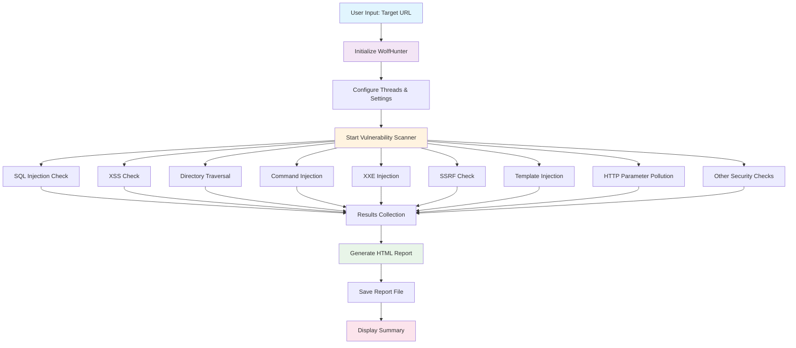

## 🏗️ Architecture & Flow

```mermaid
graph TD
    A[User Input: Target URL] --> B[Initialize WolfHunter]
    B --> C[Configure Threads & Settings]
    C --> D[Start Vulnerability Scanner]
    
    D --> E[SQL Injection Check]
    D --> F[XSS Check]
    D --> G[Directory Traversal]
    D --> H[Command Injection]
    D --> I[XXE Injection]
    D --> J[SSRF Check]
    D --> K[Template Injection]
    D --> L[HTTP Parameter Pollution]
    D --> M[Other Security Checks]
    
    E --> N[Results Collection]
    F --> N
    G --> N
    H --> N
    I --> N
    J --> N
    K --> N
    L --> N
    M --> N
    
    N --> O[Generate HTML Report]
    O --> P[Save Report File]
    P --> Q[Display Summary]
    
    style A fill:#e1f5fe
    style B fill:#f3e5f5
    style D fill:#fff3e0
    style O fill:#e8f5e8
    style Q fill:#fce4ec
```
